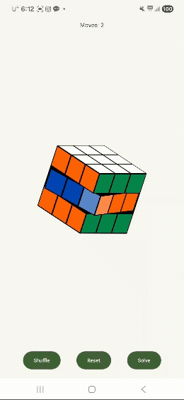

# Cube-android

Android WebView + Three.js(WebGL) 기반의 3x3 루빅스 큐브 앱입니다.



## 주요 기능

- **3D 큐브 렌더링** — Three.js(r128)로 26개 Cubie를 실시간 WebGL 렌더링
- **터치 인터랙션** — 레이어 드래그 회전, 핀치 줌, 뷰 회전, Fling 관성
- **스냅 애니메이션** — cubic ease-out 220ms 레이어 확정 애니메이션
- **셔플 / 리셋** — 랜덤 25수 셔플, 셔플 버튼 롱프레스(600ms)로 초기화
- **단계별 솔버** — cubing.js(Kociemba 2-phase) 알고리즘으로 해법 계산, 첫 수 자동 실행 후 탭마다 1수씩 진행
- **Undo / Redo** — 수동 이동 히스토리 기반 되돌리기/다시하기
- **개인 최고 기록(PB)** — 시간·이동수 localStorage 기반 PB 트래킹
- **축하 오버레이** — 솔브 완료 시 통계·PB·컨페티 애니메이션 표시
- **AdMob 리워드 광고** — 셔플당 첫 솔브 시도 시 리워드 광고 1회 시청

## 기술 스택

| 항목 | 내용 |
|------|------|
| 플랫폼 | Android (Min SDK 26 / Target SDK 35) |
| 언어 | Kotlin 2.0.21 |
| 렌더링 | Three.js r128 (WebGL via WebView) |
| 광고 | Google AdMob 23.6.0 (리워드 광고) |
| 빌드 | AGP 8.7.3 / Gradle 8.9 / JVM 17 |

## 빌드 & 실행

```bash
# 디버그 빌드
./gradlew assembleDebug

# 디바이스 설치
./gradlew installDebug
```
