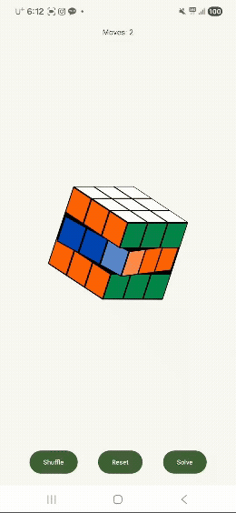

# Cube-android

Android WebView + Three.js(WebGL) 기반의 3x3 루빅스 큐브 앱입니다.



## 주요 기능

- **3D 큐브 렌더링** — Three.js(r128)로 26개 Cubie를 실시간 WebGL 렌더링
- **터치 인터랙션** — 레이어 드래그 회전, 핀치 줌, 뷰 회전, Fling 관성
- **스냅 애니메이션** — cubic ease-out 220ms 레이어 확정 애니메이션
- **셔플 / 리셋** — 랜덤 25수 셔플, 셔플 버튼 롱프레스(600ms)로 초기화
- **단계별 솔버** — cubing.js(Kociemba 2-phase) 알고리즘으로 해법 계산, 첫 수 자동 실행 후 탭마다 1수씩 진행
- **Undo / Redo** — 수동 이동 히스토리 기반 되돌리기/다시하기
- **실시간 타이머** — 셔플 완료 후 실시간 경과 시간 표시
- **개인 최고 기록(PB)** — 시간·이동수 localStorage 기반 PB 트래킹
- **축하 오버레이** — 솔브 완료 시 통계·PB·컨페티 애니메이션 표시
- **다크 모드** — 라이트/다크 테마 토글 (localStorage 저장)
- **무브 카운터** — 수동 무브 수 실시간 표시
- **햅틱 피드백** — 레이어 확정 시 진동 피드백
- **AdMob 리워드 광고** — 셔플당 첫 솔브 시도 시 리워드 광고 1회 시청
- **솔브 히스토리** — 모든 솔브 기록(시간/무브수/날짜)을 localStorage에 저장 (최대 1000건)
- **통계 대시보드** — ao5/ao12/ao100 평균, 최고 기록, 스파크라인 차트, 최근 솔브 목록
- **인앱 강제 업데이트** — Play Store 새 버전 출시 시 즉시 업데이트 유도
- **Android 15 인셋 대응** — 시스템 바와 디스플레이 컷아웃을 WebView safe area로 전달
- **순수 로직 테스트** — Jest로 큐브 무브/역무브/통계 계산 회귀 테스트

## 기술 스택

| 항목 | 내용 |
|------|------|
| 플랫폼 | Android (Min SDK 26 / Target SDK 36) |
| 언어 | Kotlin 2.0.21 |
| 렌더링 | Three.js r128 (WebGL via WebView) |
| 광고 | Google AdMob 23.6.0 (리워드 광고) |
| AndroidX | core-ktx 1.16.0 / activity 1.10.1 / fragment 1.8.5 |
| 빌드 | AGP 8.9.1 / Gradle 8.11.1 / JVM 17 |
| 테스트 | Jest 30.4.2 |

## 빌드 & 실행

```bash
# 디버그 빌드
./gradlew assembleDebug

# 디바이스 설치
./gradlew installDebug

# JS 순수 로직 테스트
npm test
```
